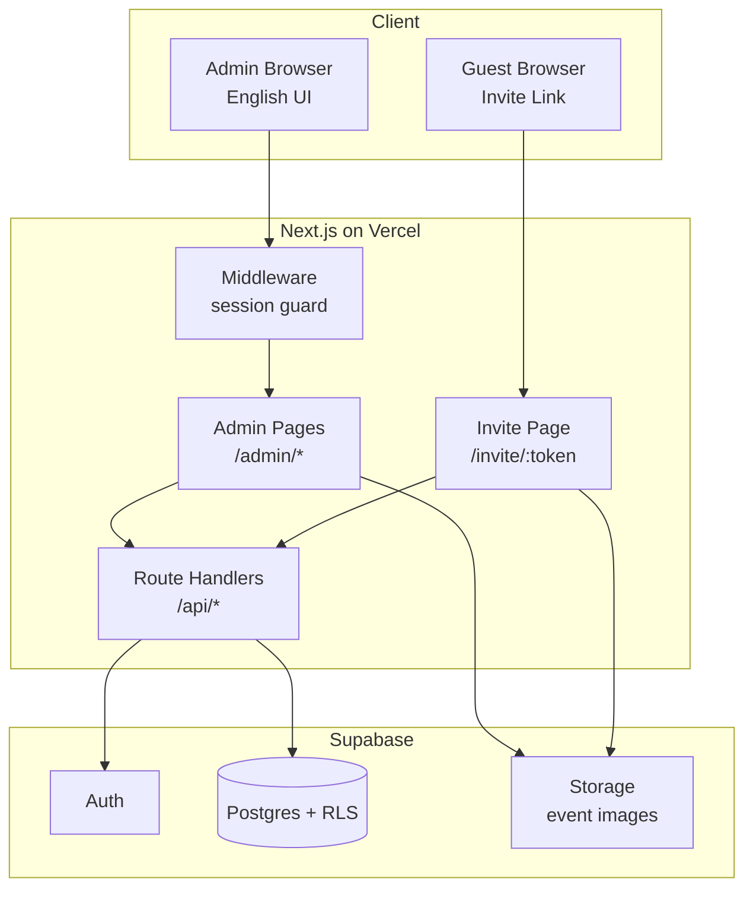
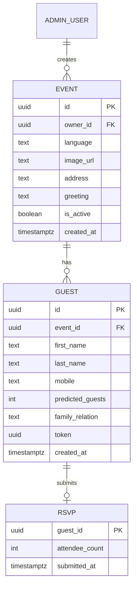

# Design Document

## Overview

AzMaNa is a Next.js full-stack application deployed on Vercel, backed by Supabase (Postgres, Auth, and Storage). It serves two audiences from one codebase:

- **Admin_App**: Authenticated, English-only pages for organizers to manage events, guests, invite links, and RSVP results. Protected by Supabase Auth with seeded accounts (no public signup).
- **Invite_Page**: A public, token-addressed page rendered per guest, localized to Hebrew (RTL) or English (LTR).

The architecture favors speed to launch: server-rendered pages and Route Handlers in a single Next.js App Router project, Supabase client libraries for data/auth/storage, and Row Level Security (RLS) to keep the public token path safe without a custom backend.

### Key Design Decisions

| Decision | Choice | Rationale |
|---|---|---|
| Framework | Next.js (App Router) | Single codebase for admin + guest, SSR for fast token-based pages, trivial Vercel deploy. |
| Data/Auth/Storage | Supabase | Postgres + hosted Auth + file Storage in one service; RLS enforces access rules. |
| Admin auth | Supabase Auth, seeded users | No signup flow needed; fastest secure path. |
| Guest access | Unguessable `Guest_Token` (UUIDv4/`gen_random_uuid`) | No guest login; link possession = access, per PRD. |
| Guest page data access | Server-side via service role in a Route Handler | Keeps token validation and active-event checks server-side; never trusts the client. |
| Image storage | Supabase Storage public bucket | Simple public URL for the invite image. |
| Localization | Per-event `language` field drives dictionary + `dir` attribute | Only two locales; no heavy i18n framework required. |

## Architecture

### Request Flows

**Admin login and management (Req 1, 2, 3, 4, 8)**
1. Admin signs in via Supabase Auth; a session cookie is set.
2. Middleware guards `/admin/*`; unauthenticated requests redirect to `/login`.
3. Admin pages call Route Handlers (or server actions) that read/write under the admin's session. RLS restricts rows to events owned by the authenticated admin.

**Guest invite (Req 5, 6, 7)**
1. Guest opens `/invite/{token}`.
2. The server component / Route Handler validates the token against the DB using a privileged server-side client.
3. If token invalid → generic denial page. If event inactive → default unavailable message. Otherwise render localized invite content.
4. RSVP submit POSTs to `/api/invite/{token}/rsvp`, which re-validates the token and active state before upserting the RSVP.

## Components and Interfaces

### Frontend (Next.js App Router)

- `/login` — Admin login form (email/password → Supabase Auth).
- `/admin` — Event list for the authenticated admin (Req 8.1). Each row shows active toggle and a link to detail.
- `/admin/events/new` and `/admin/events/[id]` — Create/edit event settings: language, image upload, address, greeting (Req 2).
- `/admin/events/[id]/guests` — Guest list CRUD and duplicate-mobile validation (Req 3).
- `/admin/events/[id]/links` — Per-guest invite links with multi-select to reveal/copy links (Req 4.2, 4.3).
- `/admin/events/[id]/rsvps` — Per-guest Attendee_Count and total confirmed (Req 8.4).
- `/invite/[token]` — Public localized invite page (Req 5, 6, 7). Sets `dir="rtl"` for Hebrew, `dir="ltr"` for English.

### Middleware

- `middleware.ts` guards `/admin/*`: validates Supabase session, redirects to `/login` when absent (Req 1.3).

### Route Handlers / Server Actions (API surface)

| Endpoint | Method | Auth | Purpose | Requirements |
|---|---|---|---|---|
| `/api/events` | POST | Admin | Create event | 2.1, 2.4 |
| `/api/events/[id]` | PATCH | Admin (owner) | Update event settings / active state | 2.5, 8.2, 8.3 |
| `/api/events/[id]/guests` | POST | Admin (owner) | Add guest (+ generate token) | 3.1, 3.2, 4.1 |
| `/api/events/[id]/guests/[gid]` | PATCH/DELETE | Admin (owner) | Edit/remove guest | 3.3 |
| `/api/invite/[token]` | GET | Public | Fetch invite view model (validated) | 5.1–5.3, 6.1–6.3 |
| `/api/invite/[token]/rsvp` | POST | Public | Upsert RSVP | 7.3, 7.4 |

### Localization

- A small dictionary module exports `he` and `en` string maps for Invite_Page labels and the greeting template.
- `Event_Language` selects the dictionary and the document `dir`. Admin UI remains English-only.
- `Navigation_Link` is built as a Google Maps URL (`https://www.google.com/maps/search/?api=1&query=<encoded address>`), which also deep-links to Waze/Maps on mobile (Req 2.3, 6.2).

## Data Models

Notes:
- `ADMIN_USER` is Supabase `auth.users`; `event.owner_id` references it.
- `event.language` constrained to `'he'` or `'en'` (Req 2.2).
- `guest.token` defaults to `gen_random_uuid()`, unique and indexed (Req 4.1).
- Unique constraint on `(event_id, mobile)` enforces per-event mobile uniqueness (Req 3.2).
- `guest.predicted_guests` has a `>= 0` check (Req 3.4).
- `rsvp.attendee_count` has a `BETWEEN 0 AND 10` check (Req 7.2). Keyed by `guest_id` so a resubmit is an upsert (Req 7.4).

### Row Level Security

- `event`, `guest`, `rsvp`: admin policies allow access only WHERE `owner_id = auth.uid()` (directly or via the guest's event).
- Public guest reads/writes do not use the anon user's direct table access; the `/api/invite/*` handlers use a privileged server-side client and enforce token + `is_active` checks in code, returning only a minimal view model.

## Error Handling

| Scenario | Handling | Requirement |
|---|---|---|
| Invalid admin credentials | Return auth error; show failure message | 1.2 |
| Unauthenticated admin page request | Middleware redirect to `/login` | 1.3 |
| Missing required event field | Server validation returns field-level errors; form highlights each | 2.4 |
| Duplicate mobile in event | DB unique violation mapped to a friendly duplicate message | 3.2 |
| Invalid/unknown token | `/invite` renders generic denial page (no event data leaked) | 5.2 |
| Token for inactive event | Render default unavailable message | 5.3 |
| Attendee_Count out of range | Client clamps 0–10; server rejects out-of-range on submit | 7.2 |
| Image upload failure | Surface upload error on the event form; block save until resolved | 2.1 |

Validation uses a shared schema (e.g. Zod) reused by client forms and Route Handlers so client and server rules stay consistent.

## Testing Strategy

Focused on core logic only, kept minimal:

- **Unit tests**: validation schemas (event required fields, mobile uniqueness mapping, attendee-count clamping/range, predicted-guests default clamp), and the Navigation_Link builder.
- **Integration tests**: `/api/invite/[token]` for the three access outcomes (valid+active, invalid token, inactive event) and `/api/invite/[token]/rsvp` upsert/replace behavior.
- **Access-control checks**: an admin cannot read or modify another admin's event via the owner-scoped policies.

Manual smoke before launch: seed an admin, create an event, add guests, open a generated invite link in Hebrew and English, submit and change an RSVP, verify counts on the RSVP view.
